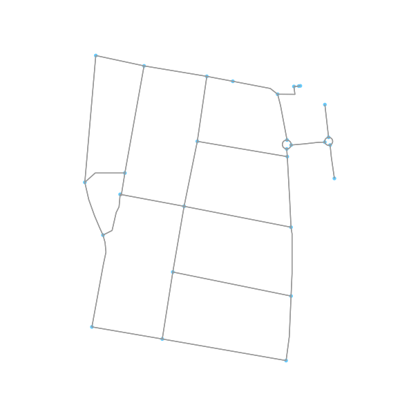
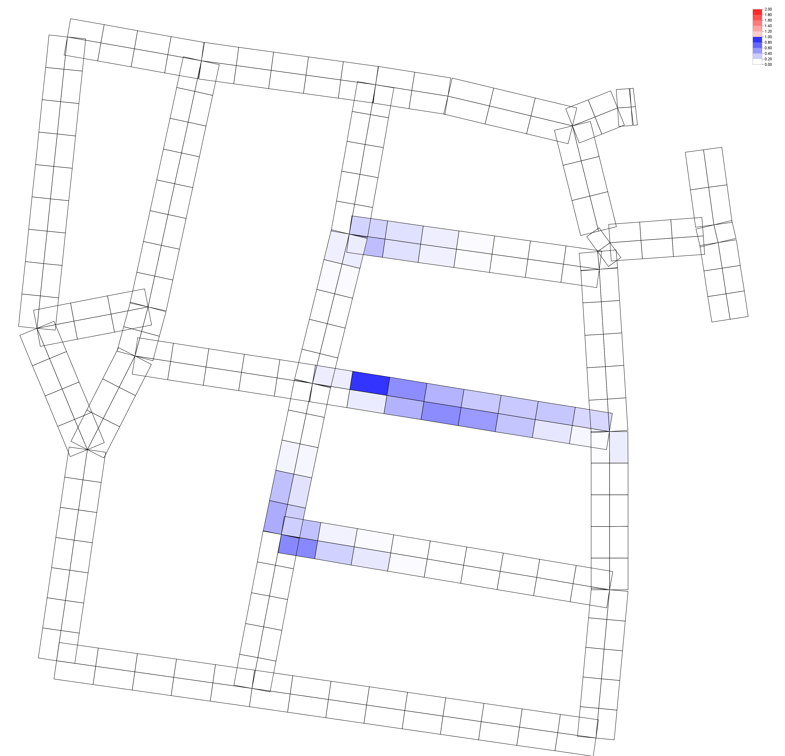

StochasticAnisoPedCTM v1.0
======

StochasticAnisoPedCTM is distributed free of charge. We ask the user to please explicitly mention the use of the package when publishing results, using the following reference:

?????????????????????????????

Please see LICENSE.md for details on usage.

## About
This repository has two components to it.
1. JAVA package for running the simulations.
2. Python scipt for generating the file which will act as the input to the JAVA package. 

The JAVA package is an implementation of macroscopic pedestrian loading model for multi-directional, anisotropic, stochastic and congested pedestrian flow. This package can help in analyzing the movement pattern of the pedestrians to enable better planning of the walkways and the repair works which are required which would lead to the lowest impact on traffic.

The Python Script is for generating the input files for the StochasticAnisoPedCTM through an automated method using data available from Openstreetmap.org. This implemetation uses the YenKShortestPaths algorithm to compute various route options that are available 
to a pedestrian to travel from one point to another. The data from OpenStreetMap is converted from Graph form to a form that represents the actual street view with various cell segregations which represents various blocks of space on the street connected with each other to form a street network. This street the network is used by StochasticAnisoPedCTM to simulate the pedestrian movement pattern.

## New features
- The street network is generated from OpenStreetMap.org and the desired input files are generated for the simulation.
- Generate street network cells and links using OpenStreetMap.org
- Generate aggregated demand based on the ODMatrix.
- Find N-Optimum route choices between the origin and destination.
- Ability to handle multiple route options and split the demand based on the stochastic route choice during the simulation.
- Introduced time-based cell blockage(a certain percentage of cell area becomes inaccessible) to simulate repair works or traffic signals.
- Enhanced visualization to incorporate streets in any orientation.

### Input from OpenStreetMap.org

### Output generated from simulation

## How to use
1. Make sure all the required python libraries are installed. The `osmnx python library` can be installed using `https://github.com/gboeing/osmnx`
2. If you are in the root directory, parse to the `DataGenerationPython` folder using the command `cd DataGenerationPython`
3. Open the `mapGeoToCells.py` file and replace the values of the variables `DISTANCE_RANGE`, `START_POINT`, `MAX_ROUTES`, `odMatrixFileNamePath`, `CELL_FILE_NAME`, `DEMAND_FILE_NAME` ,`BLOCKAGE_FILE_NAME`, `LINKS_FILE_NAME`, `ROUTE_FILE_NAME`, `FILE_CREATION_PATH_CELLS`, `FILE_CREATION_PATH_DEMAND`, `FILE_CREATION_PATH_BLOCKAGE`, `FILE_CREATION_PATH_ROUTE`, `FILE_CREATION_PATH_LINKS` with the desired ones.
4. Edit the `ODMatrix.txt` file based on the intended demand.
5. Run the python script `mapGeoToCells.py` by running the command in the command shell. `python3 mapGeoToCells.py`
6. Update the `scenario` and `parameters` files in the example folder or create your own scenrio file.
7. All the packages have been placed in the folder `StochasticAnisoPedCTM\src\anisopedctm`.Now navigate to the src folder by using the command `cd ..\StochasticAnisoPedCTM\src`. You can edit the sample `AnisoPedCTM.java` file which has been placed in that folder or create your own class with the main function. To run the sample class file execute the  file.
8. The results will be generated in the output folder.

## Reference
1. Hanseler, F. S., Lam, W. H. K., Bierlaire, M., Lederrey, G., Nikoli ́c, M., 2015. A dynamic network loading model for anisotropic and congested pedestrian flows. Presentation, 4th Annual Conference of The European Association for Research in Transportation, Copenhagen, Denmark.
2. Boeing, G. 2017. "OSMnx: New Methods for Acquiring, Constructing, Analyzing, and Visualizing Complex Street Networks." Computers, Environment and Urban Systems 65, 126-139. doi:10.1016/j.compenvurbsys.2017.05.004